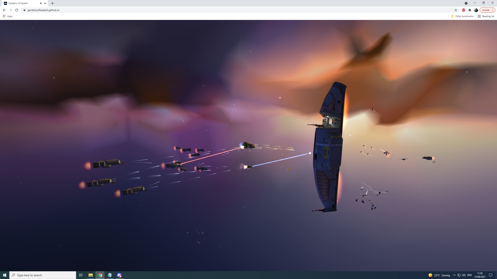
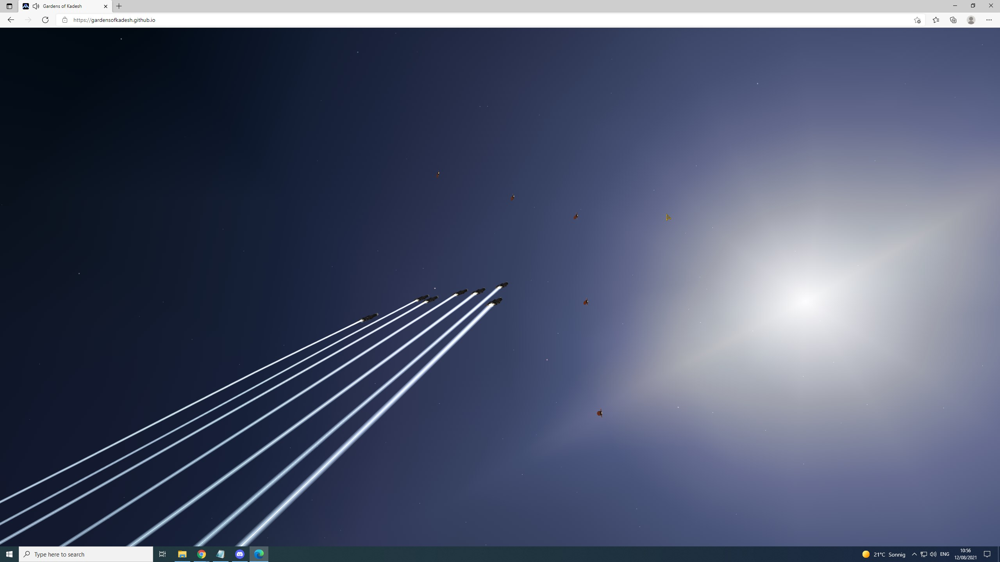
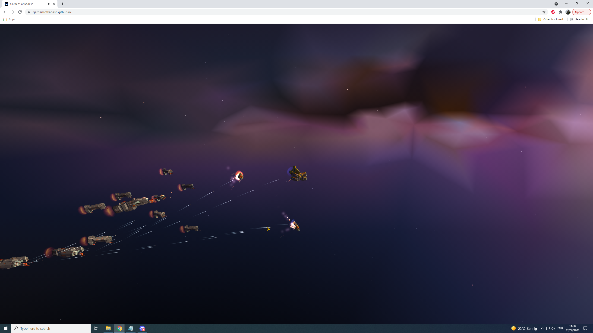
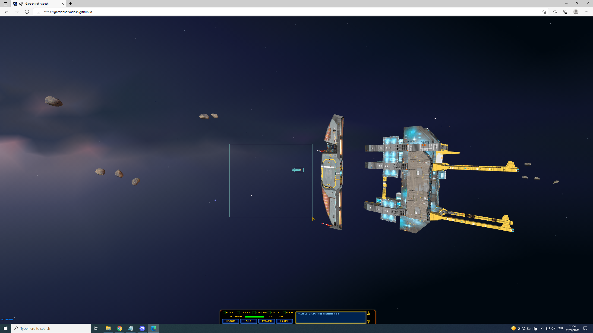
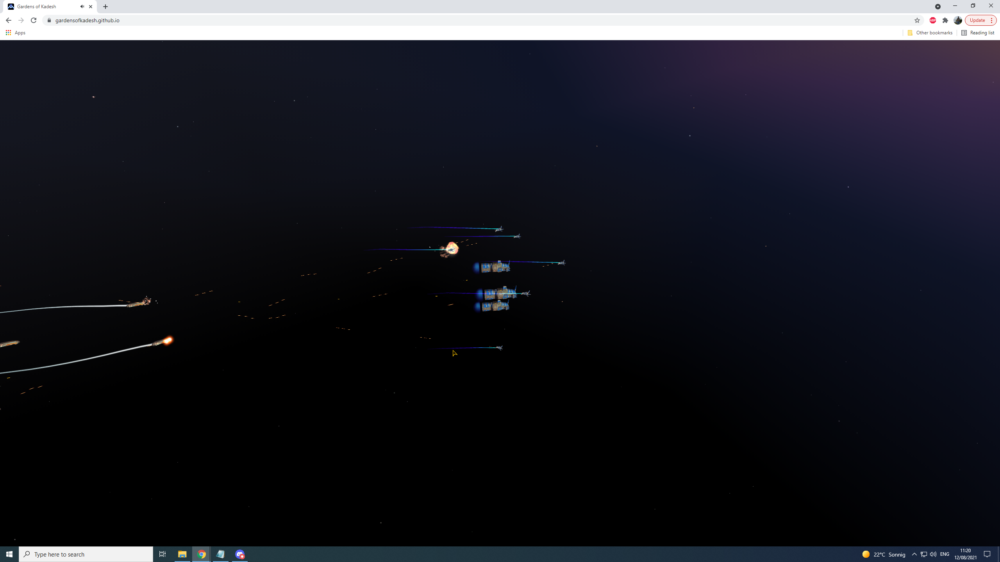

# Gardens of Kadesh
Gardens of Kadesh is a [WebAssembly] port of [HomeworldSDL]. [HomeworldSDL] is an [SDL] port of the [Homeworld] source code that was [released in 2003] by [Relic Entertainment].



### How to play
[To play direcly in your browser click here](https://gardensofkadesh.github.io/)


### About
Our goals are to continue modernizing the Homeworld engine with gentle touches while preserving the original gameplay and feel. To make the Homeworld 1 experience widely accessible on modern devices and to new generations of players.


In addition we hope to achieve awareness for the source code situation of Homeworld 1. The Homeworld source code was released under an unfavorable Relic Developer Network License.
The disappearance of the Relic Developer Network and the Homeworld IP having changed hands leaves the license state of the Homeworld source code in a dubious state that hinders development.
We aim to achieve a consideration for a re-releasing of the original Homeworld source code under GPL2/3 or re-licensing the current GardenOfKadesh/Homeworld code under GPL2/3.

If you can help us in any way, or get back to us in support, please get in touch.
Follow our project here on [github](https://github.com/GardensOfKadesh) and/or joins us on our [discord](https://discord.gg/tpBKaHVV).

### Changes
Most notable changes besides the the necessary changes described in the porting Homeworld to WebAssembly section:
- increased universe update rate for smoother gameplay (NIS animation sequences will still display at their intended 16 fps)
- dithering shader added to the vertex background system to prevent visible color banding
- LODs fixed to highest level
- tweaked the non-linear inverse perspective scaling to work better with high resolutions
- anisotropic filtering for improved texture rendering
- antialiased rendering

To see all changes between versions take a look at the [changelog](changelog.md).

### Porting Homeworld to WebAssembly
The original Homeworld engine was written in C and targeted the 32bit x86 Windows platform only. [HomeworldSDL] modified the original source code to use the cross-platform Simple DirectMedia Layer ([SDL]) to allow the engine to target not only Windows but also MacOS and Linux. Gardens of Kadesh is using [emscripten] to compile the C code base to [WebAssembly] allowing execution inside any modern web browser and by such making it runnable on nearly all modern computing devices from desktop computers, over laptops, tvs, chromebooks to tablets and phones.

Since consumer windows computer at the time were limited to rather slow, in comparison to current computers, 32bit x86 processors the Homeworld engine was heavily optimized for this specific platform resulting in the use of x86 assembly intrinsics and 32bit pointer trickery especially in the ETG system (an effect scripting system used for all graphic effects in the game). The [HomeworldSDL] project already put a lot of work into making the code more portable by adding preliminary support for 64bit x86 processors. Using [emscripten] to target [WebAssembly] is adding another processor architecture into the mix and is also introducing a new compiler that needs to be able to handle the code base. This helped with finding and fixing many bugs and issues with the source code and the previous attempts at making the engine more portable.

In addition to these lower level fixes other necessary changes were more on the architecture side. To work with [emscripten] the engine needed to be stripped of multithreading. Since browser windows can be arbitrarily shaped and resized during runtime additional functionality to handle that had to be implemented. Input handling also had to be adapted to properly work in the browser context.

Lastly the original Homeworld engine and [HomeworldSDL] use OpenGL 1.x immediate mode rendering. In OpenGL 1.x commands are used to setup a certain state and every single triangle is send one vertex at a time directly to the GPU for rendering. This was how GPUs at the time operated (for curious readers I recommend this beautiful write up about the [3dfx Voodoo](https://fabiensanglard.net/3dfx_sst1/index.html) GPU). WebGL, which is the 3d rendering API supported by modern browsers, is based on OpenGL ES 2.0 which is a much more modern approach to rendering 3d graphics. To get the Homeworld engine compilable with [emscripten] and render its graphics correctly the legacy OpenGL emulation layer of [emscripten] needed to be extended with additional features. These have been contributed back to the [emscripten] project and are already available in [emscripten] release versions starting with 2.0.25. Since the immediate mode nature of OpenGL 1.x causes a lot of API call overhead some optimizations in the form of rewriting rendering functions using modern OpenGL functionality have been done to the most critical code paths.


## Building
### Homeworld demo assets
This repository contains only the source code for Homeworld's engine (metaphorically, the skeleton). In order to have a playable game, you will need the original assets (artwork, textures, sounds, meshes, ... Metaphorically again, the flesh).

The following asset files are required to build Gardens of Kadesh based on the Homeworld demo:
- HomeworldDL.big (from the [Homeworld demo])
- DL_demo.vce (from the [Homeworld demo])
- DL_Music.wxd (from the [Homeworld demo])
- Update.big (from the [Homeworld 1.05 Patch])
- HomeworldSDL.big (see [HomeworldSDL] how to build this manually)

All the above demo assets can also be downloaded here (TODO). Alternatively wine can be used to extract them from the windows installers. See [HomeworldSDL] on how to do that.


### Build requirements
To build Gardens of Kadesh based on the Homeworld demo under linux the following preparations are required:

- copy all the above listed asset files into the wasm/ folder of the repository
- install [emscripten] with a version >= 2.0.25 (Older versions don't include the necessary improvements to the legacy OpenGL emulation layer)

### Building process
To setup [emscripten] switch to your [emscripten] installation folder and run:
``` sh
source emsdk_env.sh
```

To run the Gardens of Kadesh build process switch to the wasm/ folder of its repository and run:
``` sh
make clean
make
```

To increase build speed add "-jX" to enable parallel building. Replace the X with the number of threads your processor has.

Make sure to issue a "make clean" after changes to the code since the Makefile is currently not properly setup to track all changes automatically.

### Running locally
The finished build can be tested locally in a browser by running:
``` sh
emrun www/index.html
```

## Media







[Discord]: https://discord.gg/tpBKaHVV
[Homeworld]: https://en.wikipedia.org/wiki/Homeworld
[HomeworldSDL]: https://github.com/HomeworldSDL/HomeworldSDL
[SDL]: https://en.wikipedia.org/wiki/Simple_DirectMedia_Layer
[WebAssembly]: https://webassembly.org/
[emscripten]: https://emscripten.org

[released in 2003]: http://www.insidemacgames.com/news/story.php?ArticleID=8516
[Relic Entertainment]: https://www.relic.com/

[Homeworld demo]: https://www.moddb.com/games/homeworld/downloads/homeworld-demo
[Homeworld 1.05 Patch]: http://www.homeworldaccess.net/downloads/hw1patch/si_homeworld_update_105.exe
